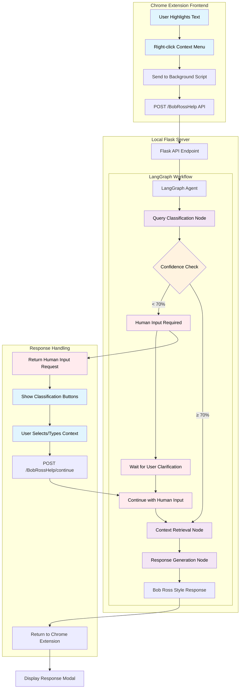

# Bob the Helper 🎨

*"Remember, there are no mistakes in code, only happy little learning opportunities!"*

Bob Ross guides users through technical challenges with his characteristic warmth and encouragement through a Chrome extension powered by Langraph and Claude for support queries.

## 🎯 Project Overview

Bob the Helper combines a Chrome extension frontend with a LangGraph agent backend to deliver contextual help for highlighted text. The system uses human-in-the-loop processing when confidence is low, ensuring users get the most accurate assistance possible.

### 🎨 Key Features Implemented

#### **Chrome Extension Frontend** (`joyOfHighlighting/`)
- **Text Selection & Context Menus**: Right-click highlighted text to trigger "Bob Ross, HELP! 🎨"
- **Confidence-Aware UI**: Visual confidence indicators show response reliability
- **Human-in-the-Loop Interface**: Interactive clarification buttons when confidence < 70%
- **Smart Continuation**: Session-based context preservation for multi-turn interactions
- **Copy & Accessibility**: One-click copying with proper focus management

#### **LangGraph Agent Backend** (`happyLittleTreesOfKnowledge/`)
- **Multi-Step Workflow**: Classify → Retrieve → Generate with confidence tracking
- **Confidence-Based Interrupts**: Automatically requests human clarification for ambiguous queries
- **Session Management**: Checkpointed conversations with thread-safe state handling
- **Robust Error Handling**: Graceful degradation with helpful Bob Ross-style error messages
- **Multiple Classification Types**: Code explanation, error help, concept learning, API usage, general help

#### **LangSmith Evaluation System** (`canvasOfConfidence/`)
- **Custom Evaluators**: Query classification accuracy and confidence calibration scoring
- **CSV Dataset Support**: Support ticket evaluation with realistic scenarios
- **Comprehensive Metrics**: Confidence distribution analysis and accuracy tracking
- **Automated Reporting**: Timestamped results with detailed breakdowns

## System Diagrams
### System Overview

### 📊 Evaluation Metrics

| Metric | Description | Target |
|--------|-------------|---------|
| **Query Classification** | Accuracy of intent detection (error_help, api_usage, etc.) | >85% |
| **Confidence Calibration** | How well confidence scores match actual difficulty | >80% |
| **Overall Confidence** | Weighted average of classification + context quality | >75% |
| **Human-in-the-Loop Trigger Rate** | Percentage of queries requiring clarification | 20-30% |

## 🚀 Local Development Setup

### Prerequisites
```bash
# Required accounts & tools
- LangChain/LangSmith account with API key
- Anthropic API key for Claude
- Google Chrome browser
- Python 3.11+
- Docker (optional, for containerized development)
```

### 1. Environment Configuration
```bash
# Clone the repository
git clone <repository-url>
cd bob-the-helper

# Create .env file in project root
cp .env.example .env

# Add your API keys to .env
ANTHROPIC_API_KEY=your_anthropic_key_here
LANGSMITH_API_KEY=your_langsmith_key_here
LOG_LEVEL=INFO
FLASK_ENV=development
```

### 2. Backend Setup (Flask + LangGraph)
```bash
cd happyLittleTreesOfKnowledge

# Install Python dependencies
pip install -r requirements.txt

# Start the Flask development server
python main.py

# Server will be available at http://127.0.0.1:8080
# Health check: http://127.0.0.1:8080/health
# Test endpoint: http://127.0.0.1:8080/test
```

### 3. Chrome Extension Setup
```bash
# Load extension in Chrome
1. Open Chrome and navigate to chrome://extensions/
2. Enable "Developer mode" (top-right toggle)
3. Click "Load unpacked"
4. Select the joyOfHighlighting/ directory
5. Extension should appear in your extensions list

# Configure the extension
1. Click the Bob Ross Helper extension icon
2. Verify endpoint URL: http://127.0.0.1:8080/BobRossHelp
3. Click "Test Connection" to verify backend connectivity
4. Click "Save Configuration"
```

### 4. Test the Complete Flow
```bash
# Test end-to-end functionality
1. Navigate to any webpage
2. Highlight some text (try: "LangChain LCEL pipeline")
3. Right-click → "Bob Ross, HELP! 🎨"
4. Observe confidence indicators and human-in-the-loop UI
5. Try low-confidence scenarios for clarification prompts
```

## 🧪 Running Evaluations

### LangSmith SDK Evaluation
```bash
cd happyLittleTreesOfKnowledge/canvasOfConfidence
python evaluation.py

# This will:
# 1. Load test cases from sample_datasets/support_tickets.csv
# 2. Run classification accuracy and confidence calibration evaluators
# 3. Generate timestamped results in .evaluation_results/
# 4. Display summary metrics in console
```

### LangSmith UI Evaluation
```bash
# Access your experiment results at:
https://smith.langchain.com

# Navigate to:
# Projects → [your-experiment-name] → View detailed metrics
```

## 🏗️ Architecture & Design Decisions

### **LangGraph Workflow Design**
- **Stateful Processing**: Uses `DocumentationAssistantState` for comprehensive context tracking
- **Confidence Thresholds**: 70% threshold triggers human-in-the-loop interrupts
- **Memory Checkpointing**: Session persistence enables conversation continuity
- **Conditional Routing**: Smart edge routing based on confidence levels

### **Human-in-the-Loop Excellence**
- **Progressive Enhancement**: Graceful degradation from high to low confidence scenarios
- **Interactive Classification**: 5 predefined query types plus custom text input
- **Session Continuity**: Thread-based state management with UUID session IDs
- **Visual Feedback**: Confidence indicators and processing step tracking

### **Bob Ross Personality Integration**
- **LangSmith Prompt Loading**: Custom Bob Ross prompt from LangSmith hub (`l2and/bob_ross_help`)
- **Fallback Prompt**: Local template ensures reliability when LangSmith unavailable
- **Encouraging Error Messages**: Even failures maintain positive, supportive tone
- **Painting Metaphors**: Technical concepts explained through art analogies


## 🎯 Future Roadmap

### **📚 Documentation Ingestion with GCS**
**Goal**: Replace static documentation with dynamic LangChain GitHub repository ingestion
- **GCS Integration**: Automated document pipeline using Google Cloud Storage
- **Benefits**:
  - **Always Current**: Automatic sync with latest LangChain docs commits
  - **Comprehensive Coverage**: Full repository indexing vs. limited static content  
  - **Advanced RAG**: Semantic search across code examples, guides, and API references
  - **Version Tracking**: Historical documentation analysis for deprecated features
  - **Ticket Categorization**: Ensure that reported tickets have a 1:1 match with current documentation. Utilize the doc structure to report on common issues, and current documentation gaps.
- **Implementation**: 
  - GitHub webhook → Cloud Function → GCS bucket → Document loader → Vector store update
  - Incremental updates to minimize processing costs
  - Smart chunking strategies for code vs. prose content

### **☁️ Complete Cloud Run Infrastructure**
**Goal**: Production-ready deployment with auto-scaling and monitoring
- **Infrastructure as Code**: Terraform/Pulumi deployment scripts
- **Auto-scaling**: CPU and memory-based scaling policies
- **Health Monitoring**: Comprehensive health checks with alerting
- **Security**: VPC networking, IAM roles, secret management
- **Performance**: CDN integration, caching layers, connection pooling
- **Cost Optimization**: Cold start minimization, resource right-sizing

### **⏰ Automated Evaluation Pipeline**
**Goal**: Continuous quality assurance with automated testing
- **Cron-Based Evaluations**: 
  - Create comprehensive evaluation runs
- **CI/CD Integration**:
  - Pre-deployment evaluation gates
  - Performance regression detection


### **🔧 Bob Ross, the Proactive Specialist**
**Goal**: On ticket creation, ensure that Bob Ross takes a quick look at all incoming tickets to document suggestions and add content via webhook
- **REST API Triggers**:
  - Immediately trigger Bob the helper to run on incoming ticket
  - Allow Support Engineers to get a headstart on issues